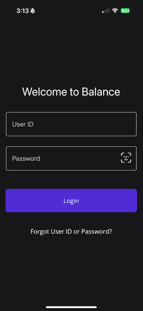

# Balance Biometric

This sample uses the [.NET MAUI sample ToDo template](https://github.com/dotnet/maui) to showcase using biometric login (FaceID, Fingerprint etc.) with the [Plugin.Fingerprint](https://www.nuget.org/packages/Plugin.Fingerprint) library.



## Setup

iOS Info.plist

```xml
<key>NSFaceIDUsageDescription</key>
<string>Need your face to unlock secrets!</string>
```

Android `AndroidManifest.xml`:

```xml
<uses-permission android:name="android.permission.USE_BIOMETRIC" />
<!-- only if you target android below level 28 -->
<uses-permission android:name="android.permission.USE_FINGERPRINT" />
```

Android `MainActivity.cs`:

```csharp
protected override void OnCreate(Bundle savedInstanceState)
{
    base.OnCreate(savedInstanceState);

    CrossFingerprint.SetCurrentActivityResolver(() => this);
}
```